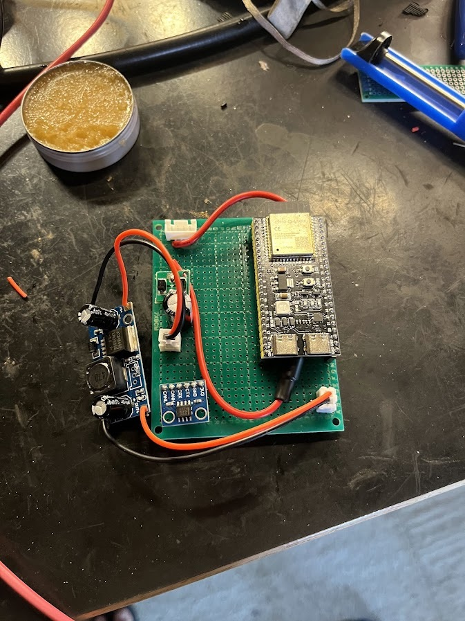
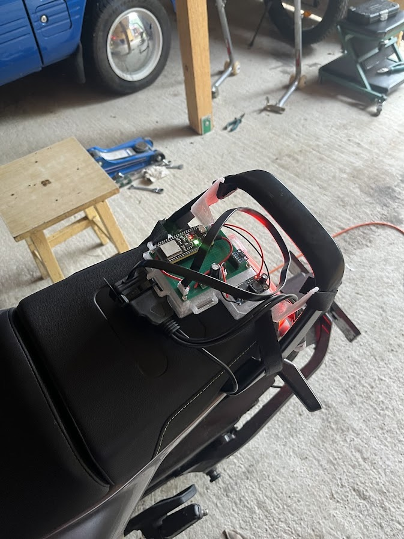
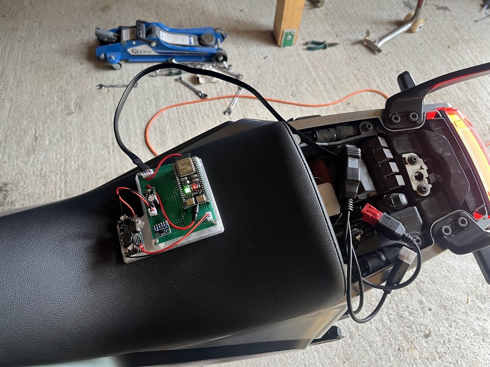
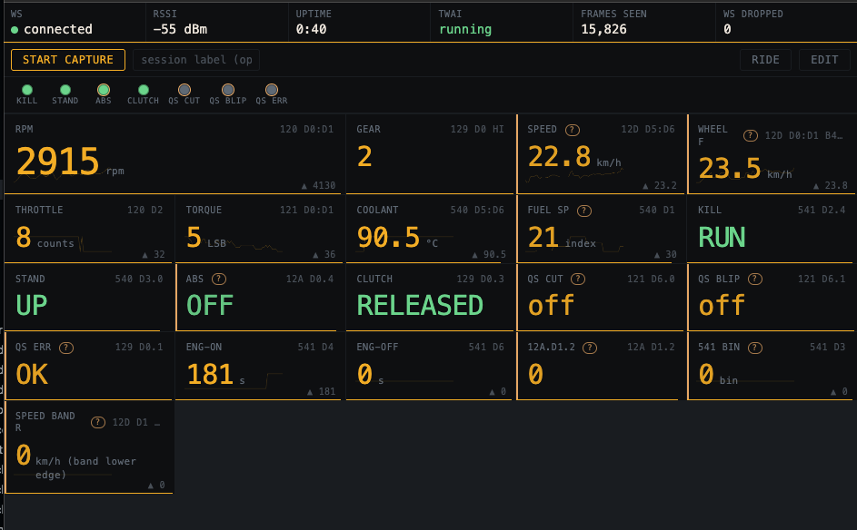
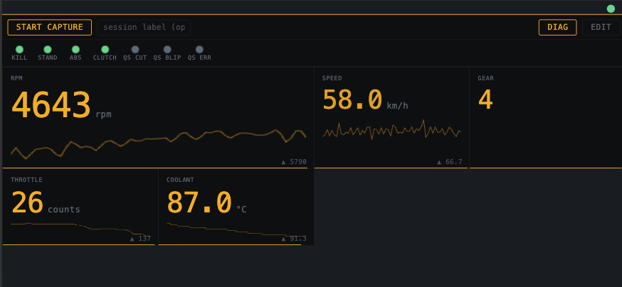
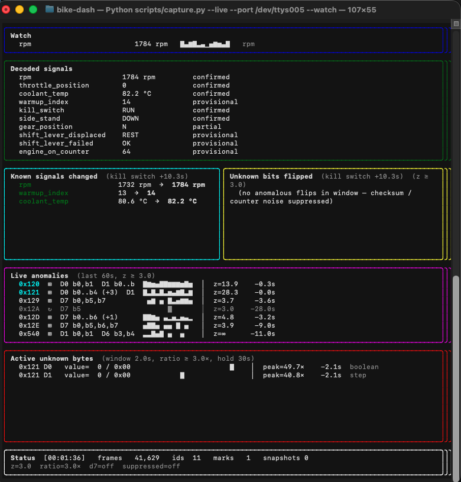

# Glassdeck

I'm building an open-source dashboard for my 2020 Husqvarna Svartpilen 401. It's a KTM 390 platform bike, so a lot of this might transfer to the Duke 390, RC 390, Vitpilen 401, and the 250 variants.

Shout out to [ktm-can](https://github.com/blalor/ktm-can) for being a very useful resource at the start of this project, even though most signals didn't map out cleanly between bikes.

It's not a dashboard yet. It's a growing map of what the OEM broadcasts on the diagnostic bus.

## Why bother?

The stock dash is _fine_ but the small stuff adds up. One combined blinker icon instead of separate left/right (why). No phone connection. Convoluted menus that I genuinely still don't remember how to navigate after owning the bike for 3 years. Membrane buttons that are hard to press, which you also can't use unless you're at a full stop because they're mounted on the dashboard itself (smart) (not).

There are closed replacement dashes out there, however due to them being commercial products none of them publish the CAN definitions they figured out, which means every person who wants to build something on this platform has to redo the reverse-engineering from scratch. That's honestly the actual motivation. It's very likely I'll never finish the dashboard, but having a public signal map for the 390 platform seemed like a good first goal.

## What's decoded

The bike puts out 11 arbitration IDs, 8 bytes each, at 500 kbps on the diagnostic port. 88 payload bytes total. So far, across 25 sessions and about 1.37M frames:

**Confirmed** — replicated across sessions, encoding pinned down.

| Signal | Where | Encoding |
| --- | --- | --- |
| RPM | `120` D0:D1 | u16 BE, 1 rpm |
| Throttle | `120` D2 | u8, closed 0, full scale 254 |
| Engine torque | `121` D0:D1 | s16 BE, ~0.25 N·m/LSB (scale still provisional) |
| Gear | `129` D0 b7:4 | enum, N and 1–6 |
| Clutch | `129` D0 b3 | bool |
| Ride mode | `12A` D2 b1 | bool, ROAD / SUPERMOTO (= rear ABS off) |
| Side stand | `540` D3 b0 | bool |
| Coolant temp | `540` D5:D6 | u16 BE, 0.1 °C |
| Kill switch | `541` D2 b4 | bool |
| Engine-on seconds | `541` D4 | u8, wraps at 256, 1 Hz |
| Engine-off seconds | `541` D6 | u8, wraps at 256, 1 Hz |

**Provisional** — decoded, but thin evidence or an unanchored scale.

| Signal | Where | Encoding |
| --- | --- | --- |
| Wheel speed, front | `12D` D0 + D1 b7:4 | 12-bit BE, 0.1 km/h |
| Wheel speed, rear | `12D` D5:D6 | u16 BE, ~0.0565 km/h/LSB |
| ABS lamp | `12A` D0 b4 | bool, high = lit |
| Shift cut | `121` D6 b0 | bool, ECU ignition cut on shift |
| Shift blip | `121` D6 b1 | bool, downshift auto-blip |
| Shift failed | `129` D0 b1 | bool, fires ~1.5 s after a missed shift |
| Fuel-injection setpoint | `540` D1 | u8, ECU base setpoint, recomputed ~1 Hz |

Some of these are broadcast more than once: kill switch has two extra copies (`121` D5 b2, `5B0` D0 b4), engine torque a second channel at `121` D2:D3, ride mode a lagging mirror at `450` D4 b7, ABS lamp three more copies plus an inverted pair on `12E` D6, and each wheel speed a second copy elsewhere in `12D` at a different resolution. Either copy works as a source of truth.

Of the 88 payload bytes: 28 carry a signal, 42 read `0x00` under every condition tested, 9 are the D7 structural hash (6-cycle XOR ⊕ 5-bit GF(2) of D0..D6), 5 are redundant mirrors, 4 are static constants, and 0 are undecoded.

Zero undecoded bytes isn't the same as "fully mapped". Unknown structure still lives inside the partially-decoded bytes and behind the 42 always-zero ones, some of which could carry latent signals under rider inputs we haven't exercised yet. Three more slots are decoded but unattributed — `12A` D1 b2, a 3-state time bin at `541` D3, and a coarse 4-bit rear-speed band at `12D` D1 b3:0.

Full map: [`docs/signals/coverage.md`](docs/signals/coverage.md). Encoding-authoritative source: [`docs/signals/signals.yaml`](docs/signals/signals.yaml). Per-signal writeups: [`docs/findings/can/`](docs/findings/can/).

## Hardware

The Aliexpress special:

- ESP32-S3-DevKitC-1 (WROOM-1-N16R8)
- SN65HVD230 CAN transceiver breakout (3.3V, has termination on-board)
- TWAI on GPIO4 (TX) and GPIO5 (RX)
- Powered off the bike's F7 12V accessory rail via a small buck

<p align="center">
  
  
</p>

Buck on the left, transceiver in the middle, DevKitC-1 on the right. For ride captures it gets strapped to the grab handle at the rear of the bike, with the pigtail running under the passenger seat.



Wiring, pinout, BOM: [`docs/hardware/`](docs/hardware/).

## Firmware

Two subprojects (so far), both share code out of `firmware/lib/`:

- [`firmware/can-logger/`](firmware/can-logger/) - desk-tethered logger. SLCAN over USB. This is what produced every capture in `logs/` up until [`logs/2026-07-22-first-moving-ride`](logs/2026-07-22-first-moving-ride/).
- [`firmware/wifi-bridge/`](firmware/wifi-bridge/) - untethered version for moving captures. WiFi soft-AP, SLCAN over WebSocket, a browser live view at `http://192.168.4.1/`, and OTA reflash via `POST /ota`.

The live view has two modes. Diag shows every signal the build knows about, each cell tagged with the arb ID and bytes it decodes from, bus health along the top, and a `?` on anything still provisional:



Ride cuts it down to what's worth looking at while moving: RPM, speed, gear, throttle, coolant, and the warning dots.



Both are generated from [`docs/signals/signals.yaml`](docs/signals/signals.yaml) at build time, so the browser and the Python decoders can't drift apart. Cells can be hidden and reordered.

ESP-IDF via PlatformIO. Build/flash notes in [`firmware/README.md`](firmware/README.md).

## Scripts

Python stuff in [`scripts/`](scripts/). The three that got most use, at least in the beginning:

- `scripts/capture.py` reads SLCAN from the logger (USB or WebSocket), writes a labelled directory under `logs/`, and can drive a rider through a scripted procedure step by step.
- `scripts/inventory_ids.py` gives per-ID frame counts, periods, active bytes.
- `scripts/unknown_byte_sweep.py` does a corpus-wide correlation sweep against the known signals. It's how most of the mirror-byte and always-zero classifications got made.

`capture.py --live` puts a TUI up while the capture runs. Decoded signals at the top, what moved since the last mark below that, then a z-scored feed of anomalies in the bytes that aren't accounted for yet. Any signal or raw byte can be pinned to the watch pane with a sparkline:



Most of the coverage map got built in front of this - pull a lever, see which byte reacts, mark it, repeat.

Operator guide (what to actually do for a capture session): [`docs/guides/capturing.md`](docs/guides/capturing.md).

## Quick start

If you have the parts and a 390-platform bike, you can be capturing in about 15 minutes. The commands below use the wrappers in [`bin/`](bin/), run from the repo root.

1. **Build the adapter.** DevKitC-1 + SN65HVD230, wired per [`docs/hardware/can-adapter.md`](docs/hardware/can-adapter.md). TX to GPIO4, RX to GPIO5. Plug into the diagnostic connector with the bike keyed off.

2. **Flash the logger.** Needs [PlatformIO](https://platformio.org/):

   ```
   bin/flash-usb can-logger
   ```

3. **Python side.** From the repo root:

   ```
   python3.14 -m venv .venv
   source .venv/bin/activate
   pip install -r scripts/requirements.txt
   ```

4. **Capture.** Key the bike on, then:

   ```
   bin/capture-usb first-capture --live
   ```

   The port gets auto-detected; pass `--port` if you have more than one board plugged in. The TUI shows frames and decodes known signals live. `q` to stop, then fill in the `session.md` it writes (bike state, what you did, anything weird).

5. **Sanity check.**

   ```
   python scripts/inventory_ids.py logs/YYYY-MM-DD-first-capture/
   ```

   You should see the 11 always-on IDs from the [coverage map](docs/signals/coverage.md) at the periods listed there. If you're missing one, something's off with the wiring or the bike's not fully awake.

For ride captures, flash `firmware/wifi-bridge/` instead (`bin/flash-usb wifi-bridge`, or `bin/ota-wifi-bridge` once the board is on the bike). The capture then runs in the browser rather than on a laptop: join the bridge's AP, open `http://192.168.4.1/`, Start capture, ride, Stop, Export. The page writes frames as they arrive and splices over WiFi dropouts from the firmware's ring buffer.

```
python scripts/capture.py --stdin --label first-ride < ~/Downloads/capture-....log
```

See [`firmware/wifi-bridge/README.md`](firmware/wifi-bridge/README.md). Since the laptop's gone at that point, the adapter runs off the bike's switched 12V (F7, pin 4 of the diagnostic connector) through a small perfboard: fuse, reverse-polarity diode, transient cap, 12V→5V buck. Build in [`docs/hardware/f7-power.md`](docs/hardware/f7-power.md), rationale in [ADR 0015](docs/decisions/0015-f7-12v-power-path.md).

## Repo layout

```
CLAUDE.md                agent working instructions
docs/
  research.md            project brief + phase plan
  status.md              what I'm on now
  decisions/             ADRs (choice + reasoning)
  experiments/           chronological log, failures included
  findings/               current-best knowledge, one file per thing
  signals/               canonical signal defs + coverage map
  hardware/              wiring, pinouts, BOM
  guides/                operator-facing how-tos
  references/            external sources, datasheets, related projects
logs/                    raw captures
scripts/                 Python parsers, decoders, analyzers
bin/                     thin wrappers around the common pio / capture.py calls
firmware/                ESP32 subprojects (can-logger, wifi-bridge)
```

## Where to start reading

- **You have a 390 platform bike and want the CAN map.** [`docs/signals/coverage.md`](docs/signals/coverage.md), then [`docs/findings/can/`](docs/findings/can/).
- **You're doing your own CAN reverse-engineering on some other bike.** [`docs/experiments/`](docs/experiments/) and [`docs/decisions/`](docs/decisions/) are how I've been going about it. You might find that the methodology transfers. Not promising anything lol.

## Caveats

Any of this could be wrong. Findings marked `provisional` haven't been replicated across bikes or sessions. It is not a dashboard yet. If you have another 390-platform bike and want to help, another capture on the same experiments is more useful than almost anything else right now.

## AI usage

I use Claude Code quite a bit on this. It writes a big chunk of the Python, drafts firmware, and I bounce analysis off it. Check out [`CLAUDE.md`](CLAUDE.md) for the setup I use.

The bike side is fully done by me, obviously: planning, riding, wiring, running captures, and deciding when a hypothesis is solid enough to become a finding. Even though I am a software engineer by trade, guiding Claude along rather than writing everything myself has proved immensely fruitful.

One thing worth mentioning: LLMs are pretty good at producing decodes that sound right and aren't. A byte that's actually a hash gets confidently named as a counter, that sort of thing. The "no finding without an experiment" rule is partly there to catch that. Everything in `docs/findings/` links back to the raw log behind it, so you can go check.

## License

MIT, see [`LICENSE`](LICENSE).
